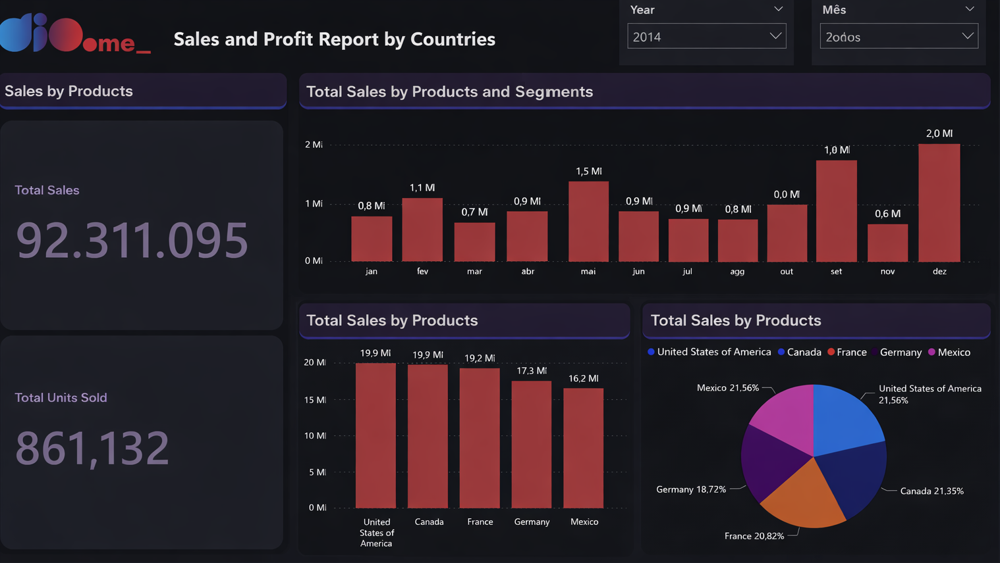
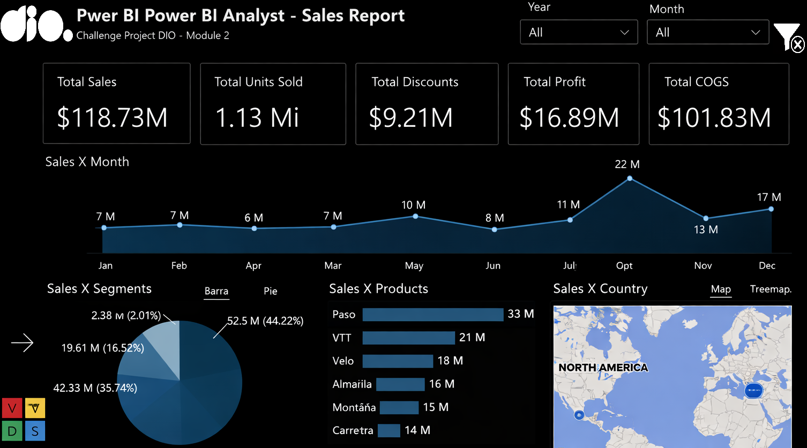
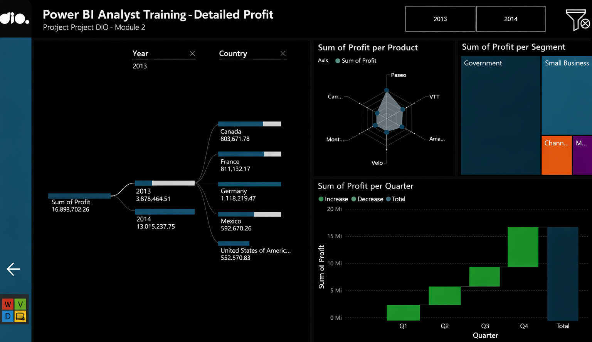

# Daily learning

[Screenshot](Img/banner-art-pbi.png)

## Project Challenge: Creating a Sales Management Report with Power BI

Project developed at the Santander Bootcamp 2023 - Data Science with Python, under the guidance of specialist [Juliana Zanelatto](https://github.com/julianazanelatto/ "Juliana Zanelatto").
Creating a Sales Management Report in Power BI Desktop based on the sample financials data from Power BI provided by Microsoft.

## Module 1: Fundamentals of Data Analysis and BI

### Project 1: Analyzing Data with My First Project in Power BI

- **Description:** This challenge aims to train your visual creation skills. This will help you become familiar with these resources. In more advanced modules, we will cover the more elaborate layout of our reports.

- **Files:** `Financial Sample PBI.pbix`
- [**Dashboard - online**](https://app.powerbi.com/view?r=eyJrIjoiODgwZDUyYjgtMWFmMC00NmI5LWI2OGYtNzBkNjE0NTM0ZjkyIiwidCI6IjlmZjQ5YWNkLTJmNTMtNGJmMS04OTkwLTRjYzY0ZGM4YjljMiJ9&pageName=ReportSection052c629dce96c532e034)

The Dashboard consists of:

- Map visual 1: Sum of sales and units sold by country;
- Map visual 2: Sum of profit by country;
- Pie chart visual: Profit by segment;

Additionally:

- Verify the layout of the visuals in the report;
- Modify the names of the visuals to something clearer and more direct (according to the context);
- Pay attention to the fields used as tooltips;
- Publish the report;
- Share as a PowerPoint add-in.

## Module 2: Data Visualization and Reporting with Power BI

### Project 2: Creating an Elegant Sales Report with Power BI

- **Description:** Create a more elaborate report based on the sample financials from Power BI.
- **Files:** `Dio-Challenge-Module02.pbix`
- [**Dashboard - online**](https://app.powerbi.com/view?r=eyJrIjoiZTBiNzgzY2EtOTA1Ni00ZDhiLWFjNDktMDU2NTE1MzQ0NDc5IiwidCI6IjlmZjQ5YWNkLTJmNTMtNGJmMS04OTkwLTRjYzY0ZGM4YjljMiJ9)

**Objectives:**

- Define structure
- Add navigation buttons that provide navigability
- Add used slicers and buttons with associated images
- Use indicators and buttons to select different visuals on the same subject
- Publish your report to Power BI Service
- Submit your project via the link on GitHub

## Module 3: Data Processing with Power BI

### Project 3: Processing and Transforming Data with Power BI

- **Description:** Create a database using MySQL, connect it to Power BI, process and manipulate the data, and create a simple visualization
- **Files:** `Dio-Challenge-Module03.pbix`

- **Steps:**

1. Create the company database in MySQL;
2. Run the script to create the database structure;
3. Run the data insert script;
4. Connect Power BI to MySQL;
5. Perform data transformation;
6. Create a simple visualization.

## Module 4: Data Modeling with Power BI

### Project 4.1: Creating a Star Schema for Sales Scenarios with Power BI

- **Description:** Create the dimensional diagram – star schema – based on the provided relational diagram.
- **Files:** `Dio-Challenge-Module04-1.pbix`

### Project 4.2: Data Modeling and Transformation with DAX using Power BI

- **Description:** Use the Financial Sample table to create the dimension and fact tables for the star schema-based model.
- **Files:** `Dio-Challenge-Module04-2.pbix`

## Module 5: Data Analytics & Storytelling with Power BI

### Project 5.1: Updating Reports in Power BI with a Focus on User Experience

- **Description:** Modify the creative report, focusing on the user experience.
- **Files:** `Dio-Challenge5-1-Module05.pbix`

## Project Challenge - Creating a Sales Management Report with Power BI

[LICENSE](/LICENSE)

See [original repository](https://github.com/julianazanelatto/power_bi_analyst).
